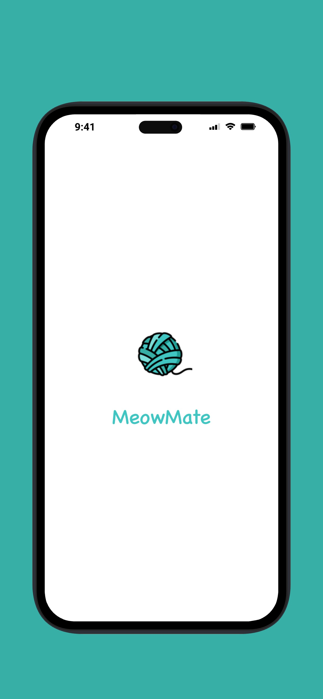
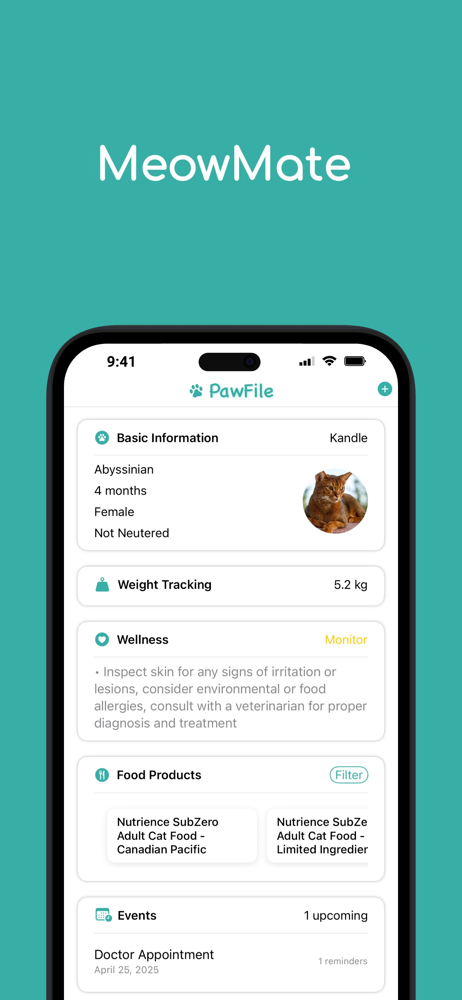
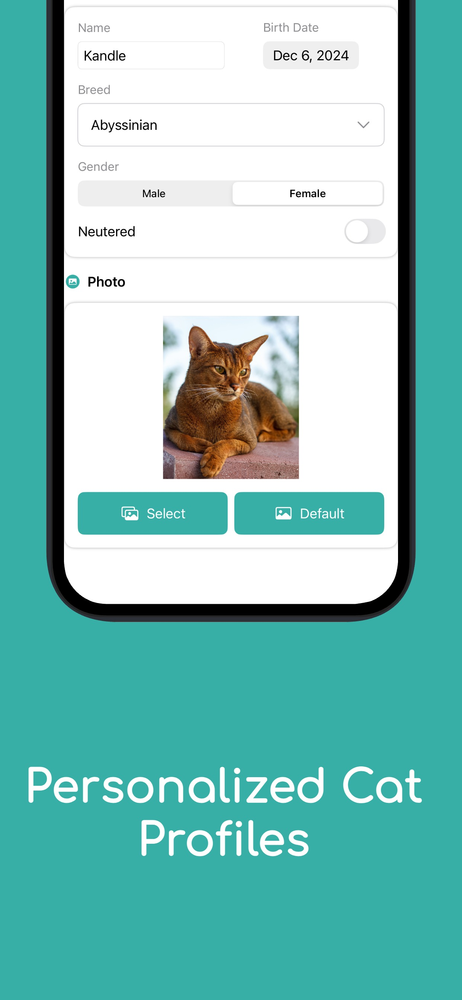
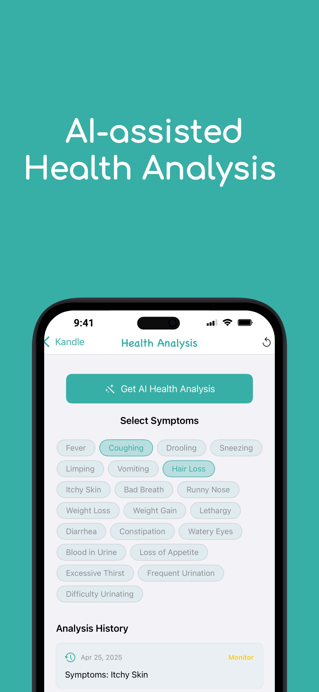
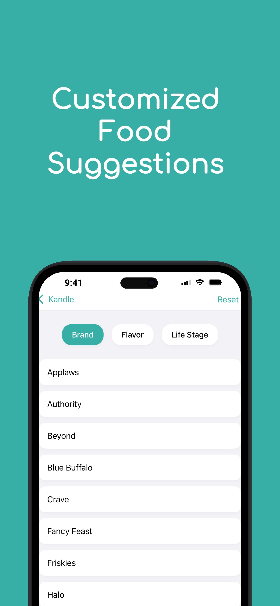

# MeowMate

## Overview
MeowMate is a comprehensive cat health management app designed for cat owners to track and improve their feline friends' well-being. The app provides features such as health monitoring, weight tracking, AI-powered health analysis, food recommendations, and event reminders, all in a user-friendly interface.

## Features
- **Cat Profile Management:** Record breed, age, gender, neutering status, and photos.
- **Weight Tracking:** Log and visualize your cat's weight history.
- **Wellness Monitoring:** AI-assisted health analysis, symptom tracking, and actionable health tips.
- **Food Recommendations:** Personalized food suggestions with direct purchase links.
- **Event Reminders:** Schedule and receive local notifications for vet appointments and other events.
- **Privacy First:** All data is stored locally on the user's device by default.

## Screenshots


## Installation
### Requirements
- Xcode 16+
- iOS 18.0+
- Swift 5.0+

### Steps
1. Clone this repository:
   ```bash
   git clone https://github.com/yourusername/MeowMate.git
   ```
2. Open `MeowMate.xcodeproj` in Xcode.
3. Install dependencies (if using CocoaPods):
   ```bash
   pod install
   ```
4. Build and run the app on a simulator or a real device.

## Project Structure
```
MeowMate.xcodeproj/      # Xcode project files
MeowMate/                # Main iOS app source code
MeowMateTests/           # Unit tests
MeowMateUITests/         # UI tests
Models/                  # Data models
Views/                   # (Legacy) Views
react-native/            # (Legacy/experimental) React Native code
server/                  # (Legacy/experimental) Server code
Info.plist               # App configuration
.gitignore               # Git ignore rules
```

## Technology Stack
- Swift & SwiftUI
- CoreData / UserDefaults (local storage)
- UserNotifications (local notifications)
- (Optional) Firebase (for analytics or cloud features)

## Privacy & Data
- All user and cat data is stored **locally** on the device by default.
- No personal data is uploaded to any server unless cloud features are enabled.
- No third-party tracking is included.

## License
This project is licensed under the MIT License. See the [LICENSE](LICENSE) file for details.

## Contact
For questions, suggestions, or support, please open an issue on GitHub.